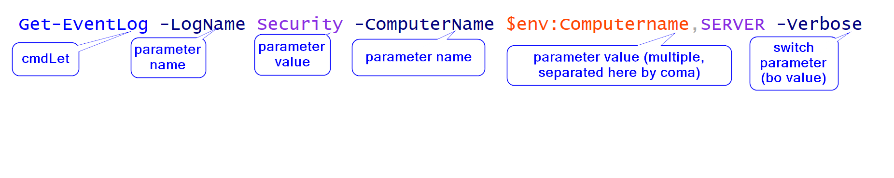

---?image=_Images/2017-09-24_13_10_11-Windows_PowerShell_ISE.png&size=auto 90%

# PowerShell Quick Start
very quick - up to 6 hours
delivered (or not :)) by Ziemek Borowski, with some lab, homework and code review

---?image=_Images/2017-09-24_13_10_11-Windows_PowerShell_ISE.png&size=auto 90%

--- 
[PowerShell Quick Start](#powershell-quick-start) - table of content, [Method of participation](#method-of-participation) [Participant requirements](#participant-requirements), [Supporting sources](#supporting-sources), [What is PowerShell?](#what-is-powershell), [Let's start](#lets-start),
[Using help](#using-help), [Running commands](#running-commands),
[The pipeline: connecting commands](#the-pipeline-connecting-commands),
[Adding commands: ... modules ...](#adding-commands--modules-), [Objects: data by another name](#objects-data-by-another-name),
[Formatting: how to do it properly](#formatting-how-to-do-it-properly), [Filtering and comparison](#filtering-and-comparison),
[Simple script](#simple-script), [Homework](#homework-1)

---
### Summary
Quick PowerShell course for people with limited experience on system administrator scripting (5 hours in person meeting + homework + online homework review session). The course is based on ["Learn Windows PowerShell 3 in a Month of Lunches, Second Edition' by Don Jones and Jeffery Hicks"](https://www.safaribooksonline.com/library/view/learn-windows-powershell/9781617291081/) and [Veeam: LEARN POWERSHELL
From Basics To A Coding Star](https://go.veeam.com/learn-powershell-basics-free-tutorial-course).  

---
### Method of participation
- 5 hours in person meeting
- homework 
- 1 hour online (WebEx/telco) meeting to review homework

---
### Participant requirements

#### Required knowledge / skills
- some knowledge on Windows Server administration
- basic knowledge on computer programming (simple VBA macros, Lego Robotics, VBScript or cmd.exe are enough). 

#### Required equipment
- Windows 7 or Windows 10 virtual machine with right to install software (WMF 5.1, from Microsoft trusted source) 
or
- working access to laboratory with Windows Server 2016 

---
### Agenda
- What is PowerShell
- How to apply for everyday tasks 
- Running commands      
- The pipeline: connecting commands 
- Adding commands: function, snap-ins, modules 

---
### Agenda cont'ed
- Objects: data by another name    
- Formatting: how to do it properly
- Filtering and comparison
- Simple function & script
- Homework selection: write script for specific needs

---
### Homework
I expect one week for homework done. In middle of that time, I will organize office hours using WebEx remote conference tool. After homework submission date, we will meet and discuss selected works. 

---
### Supporting sources
* ['Using Windows PowerShell'](https://docs.microsoft.com/en-us/powershell/scripting/getting-started/fundamental/using-windows-powershell) / free
* ['Learn Windows PowerShell 3 in a Month of Lunches, Second Edition'](https://www.safaribooksonline.com/library/view/learn-windows-powershell/9781617291081/) by Don Jones and Jeffery Hicks <small>Manning Publications / paid, also in  SafariBooksOnline (+ [video on YouTube](https://www.youtube.com/playlist?list=PL6D474E721138865A&feature=view_all))</small>
* [Windows PowerShell Cookbook, 3rd Edition](https://www.safaribooksonline.com/library/view/windows-powershell-cookbook/9781449359195/) by Lee Holmes <small>/ paid, also in SafariBooksOnline </small>
* Rafał Kraik [Powershell dla administratora Windows - kompletny kurs](https://www.udemy.com/powershell-dla-administratora-windows/) <small>/ paid, Udemy</small>
* `+` i.e. resources @ https://mva.microsoft.com/, [Veeam: LEARN POWERSHELL
From Basics To A Coding Star](https://go.veeam.com/learn-powershell-basics-free-tutorial-course)
* [MikeFal/IntroToPowershell](https://github.com/MikeFal/IntroToPowershell) / free

--- 
### What is PowerShell? 
> * PowerShell is a command-line interface (CLI),
> * that contains a rich, yet simplified scripting language for automating complex, multi-step tasks
> * Built on the .NET Framework
> * Extensible, so various products and technologies can be managed by “snapping in” tech-specific extensions

--- 
> * Most importantly... it’s **discoverable**! It can teach you how to use itself!

<small>[Windows PowerShell - Crash Course](https://channel9.msdn.com/Events/TechEd/NorthAmerica/2012/WSV321) by Don Jones and Jefferey Snover. </small>

--- 
#### before 
- DOS's `command.com`, [cmd.exe](https://ss64.com/nt/), [KixStart](http://www.kixtart.org/), [VBScript](https://ss64.com/vb/)/[JScript]() (based on Windows Scripting Host (WHS, `cscript.exe command.vbs`)
- bash, python, perl (on Unicses or via Cygwin or native ports)

```batch
for /L %u in (1,2,99) do echo %i 
IF %ERRORLEVEL% EQU 0 (Echo No error found) ELSE (Echo An error was found)
```

---
### Envisioned by [Jeffery Snover]() - 2002 
- [The Monad Manifesto](https://www.jsnover.com/blog/2011/10/01/monad-manifesto/)
- long time known as Project 'Monad'
- released as PowerShell RC1 - 2006-04
- first product requiring it was Exchange Server 2007
- PowerShell 2.0 - basic remoting 
- Windows Server 2008 R2 - Windows PowerShell 3.0 
- Windows Server 2012 - Windows PowerShell 4.0 - DSC - Desired State Configuration
- Windows Server 2016 - Windows PowerShell 5.1 
- PowerShell Core 6.0 - also on Linux, macOS (and opensource)

---
### PowerShell scope of use 
- [PowerShell System Requirements](https://docs.microsoft.com/en-us/powershell/wmf/5.1/install-configure)
- [Installing PowerShell v5.1](https://docs.microsoft.com/en-us/powershell/scripting/setup/installing-windows-powershell?view=powershell-5.1) on Windows
- PowerShell Core is a cross-platform (Windows, Linux, and macOS)... You can download and install a PowerShell package for any of the platforms
- ... but do not expect exectly the same experience

---
| Operating System Version | [WMF 5.1](https://aka.ms/wmf51download) | [WMF 5.0](https://aka.ms/wmf5download) | [WMF 4.0](https://aka.ms/wmf4download) |  [WMF 3.0](https://aka.ms/wmf3download) | [WMF 2.0](https://aka.ms/wmf2download) |
| ------------------------ | ----------- | ----------- | ----------- | ------------ |  ------------- |
| Windows Server 2016 | Ships in-box |  |  |  |  |
| Windows Server 2012 R2| Yes | Yes | Ships in-box |  |  |
| Windows Server 2008 R2 SP1 | Yes | Yes | Yes |  Yes| Ships in-box |
| Windows 7 SP1  | Yes | Yes | Yes | Yes | Ships in-box |
| Windows Server 2003| | | |  | Yes |
| Windows XP | | | |  | Yes |

---
### How to apply for everyday tasks
- interactive shell 
- ad-hoc scripts 
- tools 
- CI/CD (Contionous Integration/Contionous Delivery) 

---
### Let's start
`powershell.exe` or `ise.exe` 
```
Start-Transcript $env:Temp\GettingStarted.txt -Force

Set-ExecutionPolicy RemoteSigned -Force -Scope CurrentUser

get-host 

Stop-Transcript
notepad $env:Temp\GettingStarted.txt
```
* The console window vs `Integrated Scripting Environment`
* some confusions
    - 32- and 64-bit (select your OS version, 32-bit is for rare cases)
    - Running as Administrator (if really not needed - avoid work as escalated admin, but... sometimes it's really needed)

--- 
### Using help

* on fresh system execute <code>update-help </code> <small>require Internet access and escalate shell.</small>
* `get-help` is main command for geting help :)  
```
help get-ChildItem
help get-ChildItem -examples 
help get-ChildItem -detailed
help get-ChildItem -full 
help get-ChildItem -examples
help get-ChildItem -online
Get-Help Get-ChildItem -ShowWindow
```
* show-command Get-ChildItem 

---?image=_Memes/CopingAndPasting.png&size=auto 90%

--- 
### Discover - commands 
```
get-command 
get-command | out-grid 
get-module  | out-grid 
Get-command -Module Microsoft.PowerShell.Management
```
get-c^I (^I means - now use `Tab`key)
---
### Discover - parameters 
```
PS C:\code\bin> get-command get-member | get-member
   TypeName: System.Management.Automation.CmdletInfo
Name                MemberType     Definition
----                ----------     ----------
Equals              Method         bool Equals(System.Object obj)
GetHashCode         Method         int GetHashCode()
[...]
CommandType         Property       System.Management.Automation.CommandTypes CommandType {get;}
DefaultParameterSet Property       string DefaultParameterSet {get;}
Definition          Property       string Definition {get;}
```

---
### Running commands
- any execution should have provided a path to that file. 
- so if we have such case: 
<small>
```
PS C:\code\bin> dir
Mode                LastWriteTime         Length Name
-a----       22.06.2017     16:38       86325248 calc2017.exe
PS C:\code\bin> calc2017.exe
calc2017.exe : The term 'calc2017.exe' is not recognized as the name of a cmdlet, function, script 
file, or operable program. Check the spelling of the name, or if a path was included, verify that the 
path is correct and try again. [...] Suggestion [3,General]: The command calc2017.exe was not found, 
but does exist in the current location. Windows PowerShell does not load commands from the current 
location by default. If you trust this command, instead type: ".\calc2017.exe". See "get-help 
about_Command_Precedence" for more details.
PS C:\code\bin> .\calc2017.exe
```

</small>

---


--- 
### cmdlet? 
- cmdlet - 'command let' is internal PowerShell command (usually provided in binary form). 
- function - command in powershell which can be defined in powershell 
- command - external command (*.exe, *.cmd, *.bat)

It's strongly recommend (and always true for build-in cmdlets) to use name schema
Verb-Noun (`Get-Command`, `Add-User`).

---
### '`', `;`, $_, $?,
- $_ and $PSItem stand for “The current object in the PowerShell pipeline".
- $? and $LASTEXITCODE stand "exist code from last command"
- ` - escape next character, i.e. ``n - \n, ` at end of line supersed EOL 
- ; - separate commands in the same line 
- $Args - list of script argument
- $Error - array of errors (ussually as $Error[0])
- $Home, $PSHome 
- $true, $false, $null 
- $(command)

---
### conditions, if, else 
```
#You can use -eq, -ne, -gt, -lt, -le, -ge  to perform logical comparisons 
'1 -eq 2 returns: ' + (1 -eq 2)
'1 -lt 2 returns: ' + (1 -lt 2)
```
Get-Help about_If ; Get-Help about_While ; Get-Help about_ForEach ; Get-Help about_Switch

```
If((Test-Path 'c:\temp') -eq $false){ New-Item -ItemType Directory -Path 'c:\temp' }
Remove-Item -Recurse 'C:\TEMP'
If((Test-Path 'C:\TEMP') -eq $false){
    New-Item -ItemType Directory -Path 'C:\TEMP'
    }
if(-not (Test-Path 'C:\temp')){
New-Item -ItemType Directory -Path 'C:\TEMP'
}
```

---
### Errors 
```
$x = 1/0

#We can pull out the most recent error if necessary
$Error[0]
$Error[0] | gm

#Try/Catch/Finally allow us to better handle errors. 
$x = 1
try{ $x = 1/0 } 
catch {     Write-Warning "Operation failed."}
finally{  $x = 0 }

"`$x is $x"

#We can use throw or Write-Error to generate error messages
Write-Error "Something is wrong on the holodeck!"
```

--- 
### The pipeline: connecting commands
```
dir | get-member 
Get-Service | Export-CSV services.csv 
foreach ($i in (1..300)) {$day = (get-date).AddDays(-$i);  
    echo $day | 
    out-file  iis$((get-date $day -format s).Replace(':','-')).log -verbose }
mkdir old 
dir iis*.log | foreach {makecab $_ ; del $_ }
foreach ($file in (dir iis*.lo_)) {move $file old -verbose}
```

--- 
### Adding commands: ... snap-ins ... (quite old fashion, PowerShell 1.0)
```
PS C:\code\powershellQuickStart> Get-PSSnapin -Registered
Name        : Microsoft.BDD.PSSnapIn
Description : This Microsoft Deployment Toolkit 2010 snap-in contains cmdlets used to administer the contents of a deployment share.

PS C:\code\powershellQuickStart> Add-PSSnapin Microsoft.BDD.PSSnapIn
```

---
### Adding commands: ... modules ...
```
Get-Module 
#What module we have locally available?
Get-Module -ListAvailable 
# Starting PowerShell 4.0 (or 3.0) modules can be loaded automatically
# but in PowerShell 2.0 we need do it manually 
Import-Module     Defender
Remove-module   Defender
# what in module 
Get-Command -Module Defender  
Find-Module  PasswordsGenerator # PowerShellGallery.com

# PS C:\WINDOWS\system32> Find-Module   PasswordsGenerator
Version    Name                                Repository           Description
2.5.0      PasswordsGenerator                PSGallery              PasswordsGenerator is a PowerShell module for automating the...
Install-Module   PasswordsGenerator
Update-Module   PasswordsGenerator 
UnInstall-Module   PasswordsGenerator -whatif 
```

--- 
### Adding commands: ... functions ...
```
. .\fx-Get-ZBFunction.ps1 
```

--- 
### Objects: data by another name
```
$string="This is a variable"
$string

#We can use Get-Member to find out all the information on our objects
$string | Get-Member

$string.Length
$string.IndexOf('s')

# Powershell uses .Net objects.

$date=Get-Date
$date
$date | gm #gm is the alias of Get-Member

# Variables contains objects, so they has properties and methods 
$date.Day
$date.DayOfWeek
$date.DayOfYear
$date.ToUniversalTime()
$date.addDays(365)
```
--- 
### Formatting: how to do it properly
```
dir | ft -auto #ft is alias for Format-Table 
Get-ChildItem | Format-List 
dir | select-object FullName,Last* 
```
--- 
### Filtering and comparison
`where-object` - allow to select from results something what match for our needs
```
dir | Where-Object LastWriteTime -gt 2017-09-01
ls|Where {$_.LastWriteTime -gt 2017-09-01 -and 
        $_.Length -gt 100}
        

```

--- 
### Variables
we already use some of variables above: 
``` 
$zmienna;$string;$_;$date
``` 
Usually we use notation with dolar sign as above, but: 
```
PS C:\Code> $string = "Some characters"
PS C:\Code> $string
Some characters
PS C:\Code> Get-Variable -Name string

Name                           Value
----                           -----
string                         Some characters
```

--- 
### Variables cont'ed 
I mention that everything in PowerShell is object. List of array also are object. 
```
PS C:\Code> $dirVar = dir -recurse
PS C:\Code> $dirVar.Count
33
PS C:\Code> $dirVar | ft -a

    Directory: C:\Code


Mode          LastWriteTime Length Name
----          ------------- ------ ----
d----- 09.09.2017     22:24        bin
d----- 09.09.2017     21:56        powershellQuickStart

    Directory: C:\Code\bin
Mode          LastWriteTime   Length Name
```
---
###  output
```
$dir >> Plik.txt 
$dir | Out-File P-$((get-date -format s).Replace(':'.,'').txt 
Get-ChildItem -Recurse | Export-csv CSVFile.csv 
```
```
PS C:\Code> type .\CSVFile.csv
#TYPE System.IO.DirectoryInfo
"PSPath","PSParentPath","PSChildName","PSDrive","PSProvider","PSIsContainer","Mode","BaseName","Target","LinkType","Name","FullName","Parent","Exists","Root","Extension","CreationTime","CreationTimeUtc","LastAccessTime","LastAccessTimeUtc","LastWriteTime","LastWriteTimeUtc","Attributes"
"Microsoft.PowerShell.Core\FileSystem::C:\Code\bin","Microsoft.PowerShell.Core\FileSystem::C:\Code","bin","C","Microsoft.PowerShell.Core\FileSystem","True","d-----","bin","System.Collections.Generic.List`1[System.String]",,"bin","C:\Code\bin","Code","True","C:\","","09.09.2017 22:22:26","09.09.2017 20:22:26","09.09.2017 22:24:28","09.09.2017 20:24:28","09.09.2017 22:24:28","09.09.2017 20:24:28","Directory"
```
---
### Input

```
$variableSTR = get-content  file 
$variableCSV = Import-CSV File.csv 
$dir = dir ;  ConvertTo-Json -InputObject $dir  | out-file dir.json
gc .\dir.json |ConvertFrom-Json
```

--- 
### Simple script 

```
echo "`necho `'To jest skrypt"'" >  .\script.ps1
```

Ok, let complicate a little bit... 

```
PS p:\> echo "param(`$zmienna) `necho `$zmienna" > script.ps1
PS p:\> .\script.ps1 -zmienna "To jest argument zmiennej"
To jest argument zmiennej
````

---
### Homework 

Homework selection: write script for specific needs
<small>
<li> return date and time of the last restart - it should return at least two properties: name of machine and datetime of event 

<li> test if a specified application has been installed and if it happens after a date of creating a new version of the software (stored somewhere in local machine as MSI package). if the test goes OK: install unattended that newer version of the software. 

<li> write script which will remove all logs older than one year, and compress older than 30 days in c:\oldLogs 

<li> test if specified (as a parameter of a script) service is installed, is working. If not - start it. 

<li> test if specified website is working, if not send mail to admin or write event to Windows Eventlog 
</small>
continiue on next slide,

---
<small>
<li> test if www.test.com is available on ICMP test, if not set route to specified network to new router
<li> copy all files with extension *.pdf to the same folder (with making sure that you will don't overwrite copies)

</small>

any other send a request to me... and probably will be approved.
Delivery - as mail with *.zip file containing compressed script or on GIST and link. 

--- 
# Any questions, comment, demands??? 
